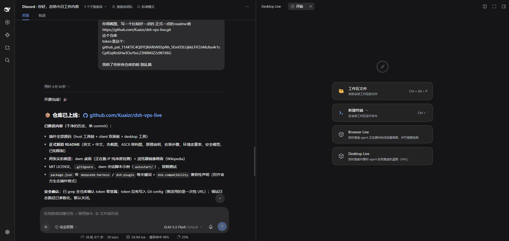
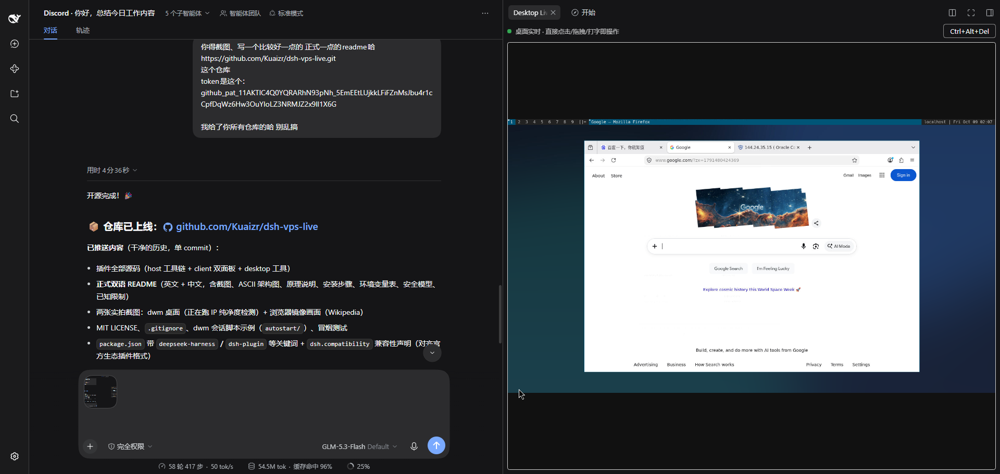

# dsh-browser-live

**Codex-style live browser & desktop mirror for [DeepSeek Harness](https://github.com/deepseek-ai/deepseek-harness).**
Watch your agent work in real time — with a virtual cursor — and take over control whenever you want.

[中文说明](#中文说明)

---


*Browser Live and Desktop Live appear as panels in the web GUI's right sidebar.*


*Desktop Live: the agent's full virtual desktop (dwm + Firefox), streamed live into the DSH web GUI.*

## What it does

One DSH plugin, two live surfaces inside the web GUI's right sidebar:

| Panel | What you get |
|---|---|
| **Browser Live** | Real-time mirror of the browser the agent drives (JPEG frames over CDP `Page.startScreencast`), a virtual cursor + click ripple showing what the agent is doing, and a **Take over** button that hands input control to you (manual release). |
| **Desktop Live** | A full virtual desktop (Xvfb + dwm + x11vnc) streamed over a WebSocket-bridged VNC (websockify-style). Click, drag, scroll and type directly — no toggle needed. |

Plus one agent-side tool, **`desktop`**, which lets the model operate the virtual
desktop (click / drag / type / key / scroll via `xdotool`) — every action visible
to you live.

## How it works

```
┌─ You (browser, behind Cloudflare Access or any auth) ──────────┐
│   Browser Live canvas          Desktop Live canvas (noVNC)     │
└───────────────┬────────────────────────┬───────────────────────┘
                │ WebSocket /browser-live/ws   WebSocket /desktop-live/ws
┌─ dsh-web host ─┴────────────────────────┴───────────────────────┐
│  browser-live plugin                                            │
│  • launches Chromium with a CDP endpoint (127.0.0.1:9222)       │
│  • browser-use provider attaches to that SAME browser, so what  │
│    the agent drives is exactly what you see                     │
│  • Page.startScreencast → JPEG frames → WS                      │
│  • takeover input → CDP Input.dispatch*                         │
│  • agent cursor → Runtime.addBinding page script                │
│  • /desktop-live/ws → auth → raw TCP bridge → x11vnc:5999       │
└───────────────┬──────────────────────────┬──────────────────────┘
                │ attach (CDP)             │ RFB
        Chromium (headless shell)        Xvfb :99 + dwm + x11vnc
```

Why not VNC for the browser? CDP screencast is damage-driven (near-zero traffic
on static pages), needs no X server, and gives pixel-accurate coordinates for
input injection. Why not CDP for the desktop? The desktop is not a browser —
VNC is the honest tool there, and a raw TCP bridge over an authenticated
WebSocket is the whole bridge (no websockify process needed).

## Requirements

- DeepSeek Harness `0.1.7-rc.2` (web profile) with the
  `@deepseek-ai/dsh-experimental-browser-use-playwright-mcp` provider mounted
- A Playwright Chromium (headless shell or full) on the host
- For Desktop Live: `xvfb`, `dwm`, `x11vnc`, `feh`, `picom` (any WM works)

## Install

### 1. Build the plugin

```sh
git clone https://github.com/Kuaizr/dsh-vps-live.git
cd dsh-vps-live
npm install
npm run build   # produces lib/index.js and lib/client.js
```

### 2. Wire it into your DSH web profile

In `$DSH_HOME/profiles/web/package.json`:

```json
"@aether/dsh-browser-live": "link:/path/to/dsh-vps-live"
```

In `$DSH_HOME/profiles/web/cordis.patch.yml`, switch the Playwright MCP
provider to **attach mode** (so the agent drives the mirrored browser) and
insert the plugin:

```yaml
- insert:
    - id: browser-live
      name: "@aether/dsh-browser-live"
    - id: browser-use
      name: "@deepseek-ai/dsh-browser-use"
    - id: browser-use-playwright
      name: "@deepseek-ai/dsh-experimental-browser-use-playwright-mcp"
      config:
        mode: attach
        endpoint: http://127.0.0.1:9222
```

Then `pnpm install` in the profile and restart `dsh-web`.

### 3. Desktop Live (optional)

Run a virtual display with a WM and x11vnc bound to loopback, e.g. as systemd
user units:

```ini
# ~/.config/systemd/user/xvfb.service
[Service]
ExecStart=/usr/bin/Xvfb :99 -screen 0 1600x900x24 -nolisten tcp

# ~/.config/systemd/user/desktop-wm.service  (see autostart/ for an example)
[Service]
Environment=DISPLAY=:99
ExecStart=/bin/sh /path/to/autostart.sh   # wallpaper, picom, dwm

# ~/.config/systemd/user/x11vnc.service
[Service]
ExecStart=/usr/bin/x11vnc -display :99 -rfbport 5999 -localhost -nopw -shared -forever -noxdamage
```

The plugin proxies `/desktop-live/ws` to `127.0.0.1:5999` after DSH
authentication — VNC never listens on a public interface.

## Configuration (environment variables)

| Variable | Default | Purpose |
|---|---|---|
| `BROWSER_LIVE_PORT` | `9222` | CDP endpoint port for the attach-mode provider |
| `BROWSER_LIVE_EXECUTABLE` | auto-detected | Chromium / headless-shell binary |
| `BROWSER_LIVE_DISPLAY` | `:99` | Display used by the `desktop` tool |
| `BROWSER_LIVE_DEBUG_LOG` | unset | When set to a path, logs the WS lifecycle there |

## Security model

- Both WebSocket routes authenticate through DSH's own connection service
  (`connection.requestRejection`) — no new anonymous endpoints.
- x11vnc and the CDP port bind to loopback only; nothing new is exposed
  publicly. Whatever protects your DSH GUI (e.g. Cloudflare Access) protects
  the live views.
- Takeover is exclusive: while you hold control, other viewers' input is
  dropped (the agent's tools remain usable, matching Codex behaviour).

## Known limitations

- The agent's cursor is tracked from DOM events; CDP-dispatched moves without
  a DOM hover show only on click.
- Screencast is damage-driven — the first frame arrives on connect (the plugin
  captures one eagerly), then on change.
- Chromium full builds with a broken crashpad can fail to start; the bundled
  auto-detection prefers the Playwright headless shell, which does not use
  crashpad.
- The `desktop` tool returns text results; screenshots-to-model (durable
  attachments) are left to DSH's own computer-use providers.

## License

[MIT](LICENSE) © Kuaizr

---

<a id="中文说明"></a>
# 中文说明

**面向 DeepSeek Harness 的 Codex 风格实时浏览器 / 桌面镜像插件。**
实时观看 agent 操作（带虚拟光标），随时接管控制。

## 功能

| 面板 | 能力 |
|---|---|
| **Browser Live** | 实时镜像 agent 正在操作的浏览器（CDP `Page.startScreencast` JPEG 帧流）；虚拟光标 + 点击涟漪显示 agent 动作；一键**接管**输入（手动释放） |
| **Desktop Live** | 完整虚拟桌面（Xvfb + dwm + x11vnc），WebSocket 桥接 VNC（websockify 式）；直接点击 / 拖拽 / 滚动 / 打字 |

另注册 agent 工具 **`desktop`**：模型可通过 xdotool 操作虚拟桌面（click / drag / type / key / scroll），你的面板实时可见。

## 原理

- 插件启动 Chromium 并暴露仅本机的 CDP 端口（默认 `127.0.0.1:9222`）；
  browser-use 的 Playwright MCP provider 配置为 **attach 模式**连接同一浏览器，
  因此 **agent 操作的页面 = 你看到的页面**。
- `Page.startScreencast` 是变化驱动的：静态页面几乎零流量；客户端接入时插件
  主动抓取一帧，之后按变更推帧。
- 接管的输入通过 CDP `Input.dispatchMouseEvent / dispatchKeyEvent` 注入。
- agent 光标由页面注入脚本经 `Runtime.addBinding` 回报坐标。
- 桌面通道：`/desktop-live/ws` 完成 DSH 认证后，做 WebSocket ↔ VNC 裸 TCP 桥
  （内置于插件，无需额外 websockify 进程），并带协议层 keepalive 防止
  Cloudflare 掐断空闲连接。

## 安装

```sh
git clone https://github.com/Kuaizr/dsh-vps-live.git
cd dsh-vps-live && npm install && npm run build
```

在 `$DSH_HOME/profiles/web/package.json` 加入：

```json
"@aether/dsh-browser-live": "link:/path/to/dsh-vps-live"
```

在 `cordis.patch.yml` 中把 playwright provider 改为 attach 模式并插入插件
（见上文英文部分的 YAML 示例），然后 `pnpm install` 并重启 `dsh-web`。

### 桌面环境（可选）

需要 `xvfb`、任意窗口管理器（示例用 dwm）、`x11vnc`（仅监听 127.0.0.1）。
`autostart/` 目录有可直接使用的会话脚本示例。

## 环境变量

| 变量 | 默认 | 说明 |
|---|---|---|
| `BROWSER_LIVE_PORT` | `9222` | CDP 端口 |
| `BROWSER_LIVE_EXECUTABLE` | 自动探测 | Chromium / headless shell 路径 |
| `BROWSER_LIVE_DISPLAY` | `:99` | `desktop` 工具使用的显示器 |
| `BROWSER_LIVE_DEBUG_LOG` | 未设置 | 设置为路径时记录 WS 生命周期日志 |

## 安全模型

- 两条 WS 路由都走 DSH 自带认证（`connection.requestRejection`），无匿名端点
- x11vnc 与 CDP 端口只绑定 127.0.0.1，不新增公网暴露面
- 接管为独占式：你持有控制权时其他观看者的输入被丢弃

## 兼容性

针对 DeepSeek Harness `0.1.7-rc.2`（web profile）开发与验证。
DSH 仍处于 Developer Preview，后续版本可能需要适配。

## 许可

[MIT](LICENSE) © Kuaizr
